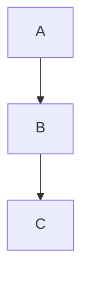

# Titre
## Sous-titre
### Plus petit titre

**Gras**

*Italique*

~~Barré~~

`code`

> Citation

- Liste
- Liste

1. Liste numérotée
2. Liste numérotée

- Liste
  - Liste
  - Liste

# Sommaire

- [Présentation](#présentation)
- [Projets](#projets)

[Lien](https://github.com)


<p align="center">
Hello
</p>

    texte dans un cadre

```javascript
console.log("Hello");
```

- [x] Terminé
- [ ] A faire

<details>
<summary>comment ca marche ?</summary>
comment ça
tu peux faire pleins de choses
</details>

<br alt=espace-vide>

<hr alt=trait-de-séparation>


